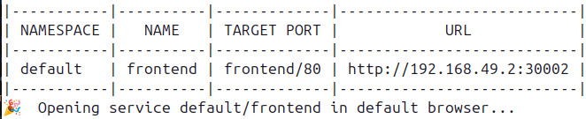
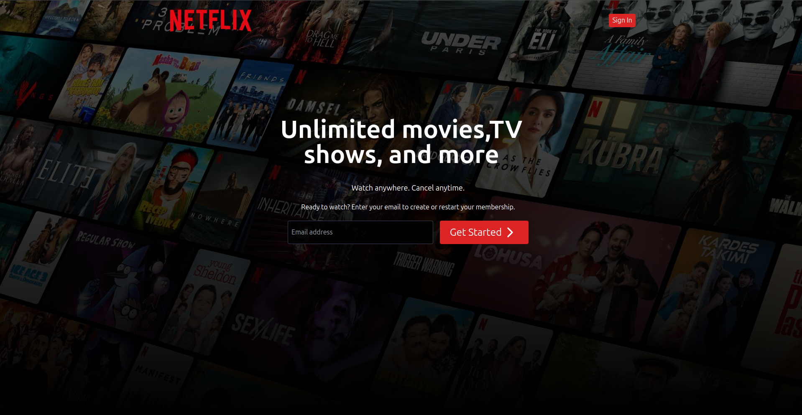
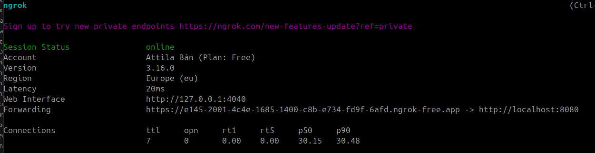

**This project is only for educational purposes!**

## MERNFLIX (NETFLIX CLONE)

This project is a web application consisting of a React + Vite + TypeScript frontend and an Express.js backend, integrated with a MongoDB database and the TMDB API. The project is Dockerized with Jenkins CI/CD automation and Kubernetes deployment on Minikube.

## Table of Contents

- [Key Technologies](#key-technologies)
- [Features](#features)
- [Requirements](#requirements)
- [Installation](#installation)
  - [1. Using Docker](#using-docker)
  - [2. Using Minikube](#using-minikube)
- [CI/CD Automation](#cicd-automation)
- [Environment Variables](#env-vars)

## Key Technologies

- **Frontend**: React, Vite, TypeScript, TailwindCSS, Lucide-react
- **Backend**: Express.js, MongoDB, TMDB API, JsonWebToken,Bcrypt,CookieParser
- **Containerization**: Docker, Docker Compose
- **CI/CD**: Jenkins, GitHub integration
- **Deployment**: AWS ECR, Kubernetes (Minikube)

## Features

- **Frontend**: A responsive web interface built with React, styled with TailwindCSS, and using Lucide-react icons.
- **Backend**: A REST API built with Express.js, connected to MongoDB, and integrated with TMDB for movie data.
- **Docker**: Both frontend and backend are containerized using Docker, with Docker Compose for easy multi-container orchestration.
- **CI/CD Pipeline**: Automated build and deployment triggered by GitHub pull requests using Jenkins.
- **Kubernetes**: The application is deployed in a Minikube environment, with images pulled from AWS ECR.

## Requirements

- [Docker](https://www.docker.com/get-started)
- [Docker Compose](https://docs.docker.com/compose/install/)
- [Node.js](https://nodejs.org/) (for local development)
- [Jenkins](https://www.jenkins.io/) (for CI/CD pipeline setup)
- [Minikube](https://minikube.sigs.k8s.io/docs/start/) (for Kubernetes deployment)
- [AWS CLI](https://aws.amazon.com/cli/) (for AWS ECR access)

## Installation

**If you run the application with docker the nginx.conf file should contain _proxy_pass:http://backend:5000_ if you want to deploy in kubernetes it should looks like: _proxy_pass http://backend-service.default.svc.cluster.local:5000_ I assume you've done this changes if it was need**

*** I assume that you have AWS account and have your own ECR and you will use your own credentials ***

### Using Docker

1. **Create backend container**:

   1. docker build -t backend-image .
   2. docker run --env-file ./backend/.env -d --name backend --network mynw -p 5000:5000 backend-image

2. **Create frontend container**:

   1. docker run -d --name frontend --network mynw -p 80:80 frontend-image
   2. docker build -t frontend-image .

3. **Run containers with docker-compose**

   1. docker build -t frontend-image .
   2. docker build -t backend-image .
   3. docker compose up

### Using Minikube

**_Note that you have to create the required credentials like aws ecr login for this part_**

1.  **Deploy backend in minikube**
    **Assume you applied your own secret files** 1. kubectl apply -f backend-deployment.yaml

2.  **Deploy frontend in minikube**
    **Assume you applied your own secret files** 1. kubectl apply -f frontend-image.yaml

3.  **Start minikube service so you can reach the page from the cluster**

    1.  minikube service frontend

    

    **If you done everything right you will see the main page**

    

### CI/CD Automation

1.  **Start the Jenkins server with the Dockerfile from the root directory**
**WARNING!**
This solution is unsafe for production use, as it relies on running as root and sharing the docker.sock. Only for educational purposes.

    1.  docker build -t custom-jenkins .
    2.  docker run -p 8080:8080 \
        -v jenkins_home:/var/jenkins_home \
        -v /var/run/docker.sock:/var/run/docker.sock \
        custom-jenkins

2.  **Creating the Automation**

    1.  Create a Pipeline project
    2.  Enable GitHub hook trigger for GITScm polling
    3.  Paste the content of Jenkinsfile into the job

    ***Open GitHub Repository***

    1. Expose your port (8080) with ***ngrok**
    
    2.  Settings -> Webhooks
    3.  Paste your URL into Payload URL like : url/github-webhook

### Environment Variables
***See the samples***

***Docker (.env)***
    1. MONGO_URI=mongodb-connection-string
    2. TMD_API_KEY=api-key-for-tmdb-database
    3. JWT_SECRET=secret-for-jwt

***Kubernetes (Kubernetes Secret)***
    1.  mongodb-connection: connection-string-in-base64
    2.  tmdb-key: connection-string-in-base-64
    3.  jwt-secret: connection-string-in-base-64
***AWS-Credentials***
    4.  dockerconfigjson:
        -   copy the content of ***$HOME/.docker/config.json***
        -   paste into the secret in base-64 format

***Jenkins***
    1.  AWS-Credentials 

